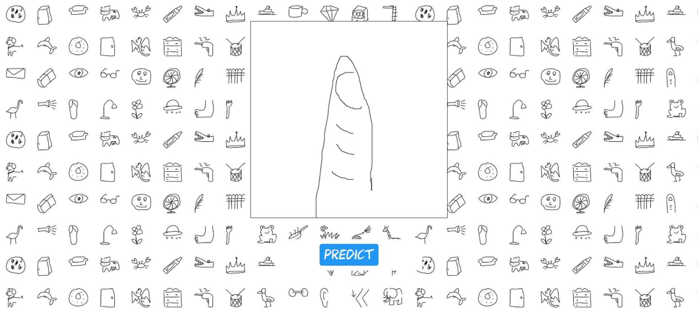
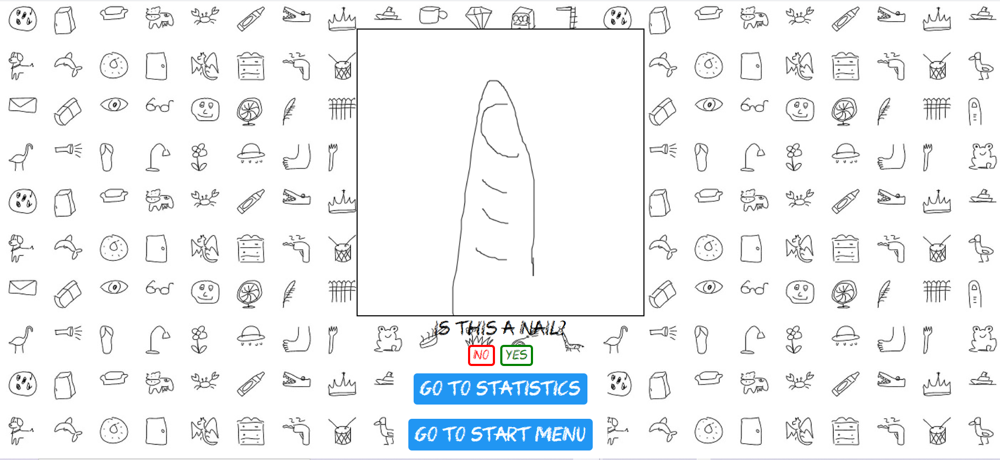
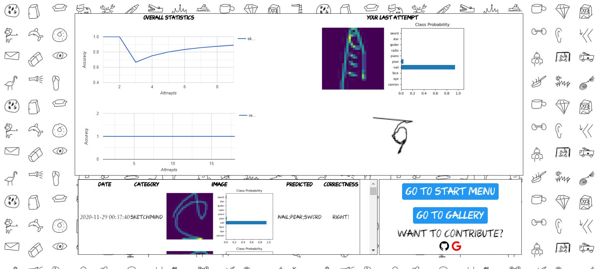
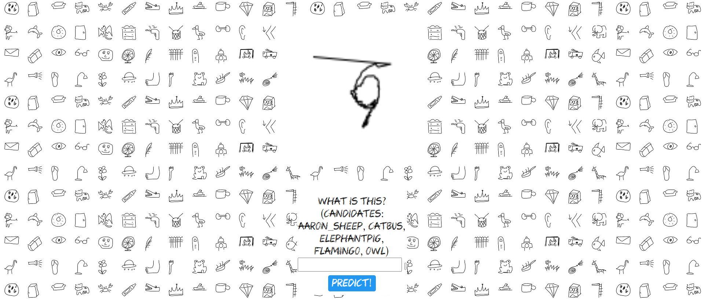
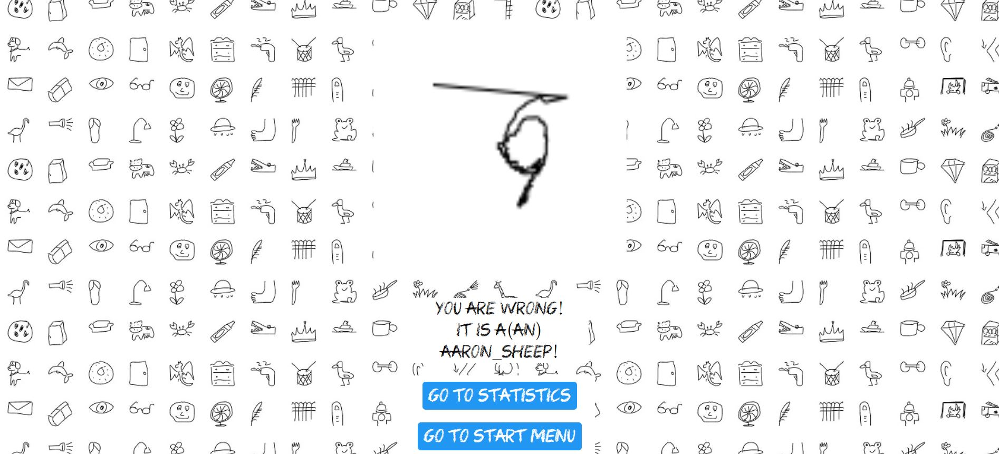

# CS470
This is the fall semester 2020 final project of our team for CS470, KAIST.
## Introduction

### posing the problem
You might have heard of classic online game called [catchmind](http://cmind.netmarble.net/main.asp). It is a multi-player game which a player takes trun to draw the hidden subject, 
while others try to guess what the subject is.

One of the main problem of this game is that it needs multiple people to play. If there is only one player, then the game is meaningless.

We thought that it would be nice if we solve this by using some deep learning techniques. More precisely, we wanted a game that single player can enjoy with most of the functions which 
catchmind have. It includes 1. let the player draw whatever he wants, and let the AI predict what it is, and 2. let AI generate a drawing of a hidden subject, and let the player guess
what the subject is. 
### what we made
So here is a brief description of what we made:

We made a small flask-based project with some python, javascript which runs locally in your computer.

You can enter

    python app.py
    
in your 'flask' directory, and after terminal shows this message, 

    * Running on http://127.0.0.1:5000/ (Press CTRL+C to quit)

you can locally connect to http://127.0.0.1:5000/ to run the project.

If you go to the link, ss you see, there are 4 tabs in the start page.
The first tab is a tab which you can click and draw whatever you think, and let the AI predict what it might be.

There are 3 chances for AI to guess. If AI guessed what you think within 3 times, then it is considered as a correct guess, and vice versa. 

You can jump to [demo](#demo-for-Sketchmind) if you just want to see the demo play.

The second tab is a tab which AI generates a drawing. It is a generated drawing of a certain class, which is hidden, but you can see the candiates of the class.

There is only 1 chance for you to guess what the drawing is. If you consider it right, then it is considered as a correct guess, and vice versa.

You can jump to [demo](#demo-for-Revenge-of-AI) if you just want to see the demo play.
## Sketchmind - Sketch recognition
### demo for Sketchmind
If you click the first tab, then a canvas will appear. Draw whatever you want to draw among the 10 classes below:

    ['cannon','eye', 'face', 'nail', 'pear','piano','radio','spider','star','sword']
    
I want to draw a nail, so this is the result.

If you click the predict! button, you will see the result tab.

If you click "yes" with less than 3 "no"s, then it will automatically recognize as a right prediction.

However, if you click "no" 3 times, then it will recognize it as a wrong prediction, and will automatically download a modified history.json file. Place it in

    ./static/

directory(overwrite history.json file). 

The project will automatically move to statistics.html, which is shown as below:

As you see, the upper box consists of two columns, one is the graph of the accuracy of of AI, which divides the right prediction by the total attempts you played.

The other column consists of information of your last attmept. If your attempt is not updated, just press Ctrl+Shift+R button to refresh the cashes, and you will see.

Since you played the first tab, only the first tab will be updated.

## Revenge of AI - Sketch generation
### demo for Revenge of AI

If you click the second tab, then there is a generated drawing within the candidates below: 

    ["aaron_sheep", "catbus", "elephantpig", "flamingo", "owl"]
    

I think it is a flamingo, so type flamingo and click the predict! button.

It says that I am wrong! now, it will automatically download a modified history.json file. Place it in

    ./static/

directory(overwrite history.json file). 

Now press "Go to statistics" button, and you will see the same html file we saw at the first demo.

Since you played the second tab, only the second tab will be updated.
## Problem